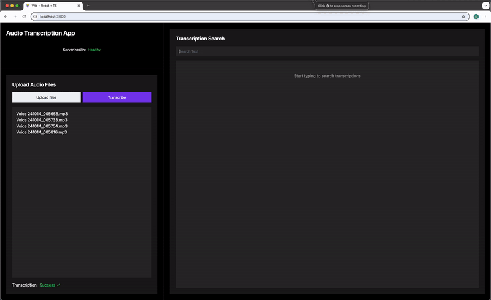

# transcription-fullstack-app

Implementation of an audio transcription fullstack application with Whisper-tiny model from HuggingFace



# tech stack

- Frontend: Typescript (Vite template, lucide, shadcn)
- Backend: Python (FastAPI, Sqlite, Huggingface)

# To start

```
docker compose -f docker-compose-prod.yml build --no-cache
docker compose -f docker-compose-prod.yml up
```

Frontend: localhost:3000
Backend: localhost:8080/docs

# TODO
